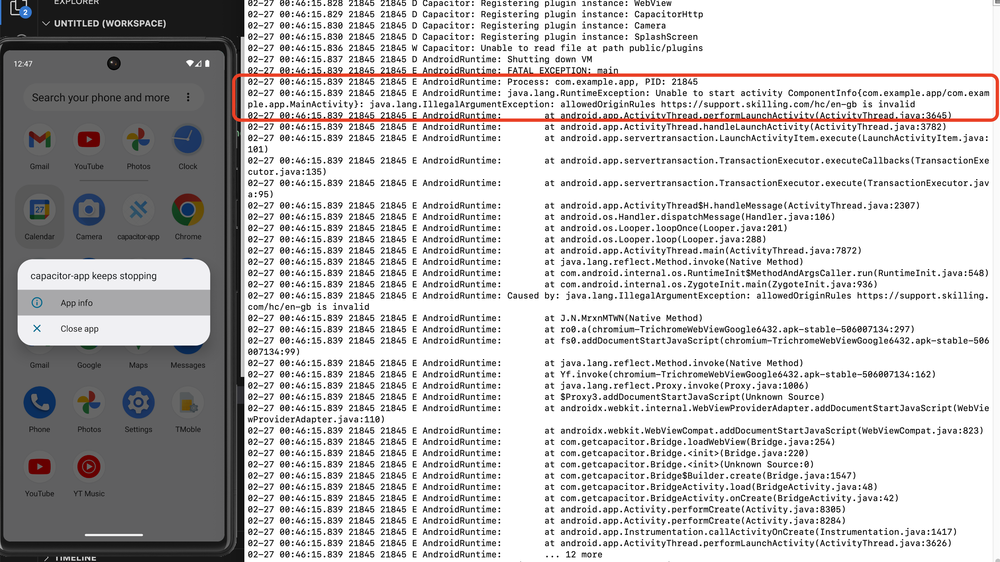

# capacitor-undefined-demo

## Commands to setup project
> `npm init @capacitor/app` was used to create this base project 
> Also added Android app to dependencies `npm i @capacitor/android`

## Run commands

```bash
# Remove previous dependencies to install new custom Android package
cd app && rm -rf node_modules && npm install && npm run build

sh build-android.sh
```

## Steps to reproduce

1. Open `adb logcat` in terminal 

2. Run app with run commands `sh build-android.sh` (Make sure you install and build app first to create base files)

2. App should crash and stacktrace `Caused by: java.lang.IllegalArgumentException: allowedOriginRules https://support.skilling.com/hc/en-gb is invalid` is thrown in terminal

**Screenshot - allowedOriginRules invalid**


**Note**

I have looked over code inside `@capacitor/android/capacitor/src/main/java/com/getcapacitor/Bridge.java` and other files about allowedOriginRules but I cannot see that the business logic has changes since Capacitor 5.0.
